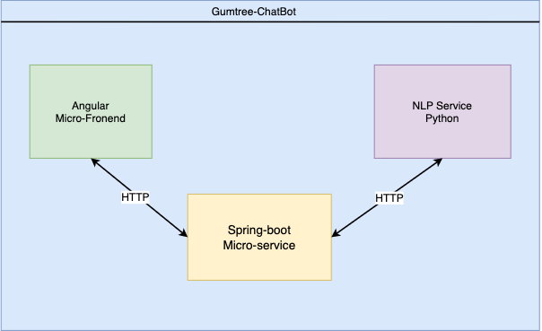

# Chatbot Application

## Description

The Chatbot Application is a web-based chatbot system that utilizes natural language processing (NLP) to provide automated responses to user queries. The application consists of an Angular frontend, a Spring Boot middleman service, and a Python NLP service.

### Directories for all 3 services 
>`*` Frontend (Angular) - https://github.com/mokoenaHluga/project-730-chatbot \
> `*` Mediator(Java -s Spring-boot)  https://github.com/mokoenaHluga/Gumtree-Chatbot/blob/master/README.md -\
> `*` NLP Service (Python) -	https://github.com/mokoenaHluga/Gumtree-chatbot-answer-generator/README.md
## Technologies Used

`*` Angular 12.0.0\
`*` Spring Boot 2.5.0\
`*` Python 3.9\
`*` H2 Database 1.4.200

## Architecture Overview

The Angular frontend serves as the user interface for interacting with the chatbot. When a user sends a message, the frontend communicates with the Spring Boot middleman service via HTTP. The middleman service acts as a mediator and forwards the user's message to the Python NLP service for processing. The NLP service analyzes the message and generates an appropriate response, which is then sent back to the frontend through the middleman service.

## Installation

`1` Make sure you have Node.js and Angular CLI installed.\
`2` Clone the repository: git clone https://github.com/your-username/your-repo.git. \
`3` Install frontend dependencies: cd frontend && npm install. \
`4` Install backend dependencies: cd backend && ./mvnw install.
`5` Install NLP service dependencies: 

# Configuration

## H2 Database
The application uses an H2 in-memory database to store session data for users who wish to chat with an agent. No additional configuration is required for the H2 database.

## Usage

 `1` Start the backend server: cd backend && ./mvnw spring-boot:run. \
 `2` Start NLP service server: 
 `3` Start the frontend application: cd frontend && npm start. \
 `4` Access the application in your browser at http://localhost:4200. 

Once the application is running, you can interact with the chatbot by typing messages in the provided input field. The chatbot will respond with appropriate replies based on the NLP analysis.

# API Documentation

This application does not expose any public APIs.

# Troubleshooting

If you encounter any issues or errors while running the application, please try the following troubleshooting steps:

`.` Ensure all the dependencies are installed correctly. \
`.` Double-check the configuration settings, including environment variables and database setup. \
`.` Refer to the project's issue tracker on GitHub to see if the issue has been reported or resolved. \
`.` If the problem persists, feel free to contact the project maintainer for assistance. \
